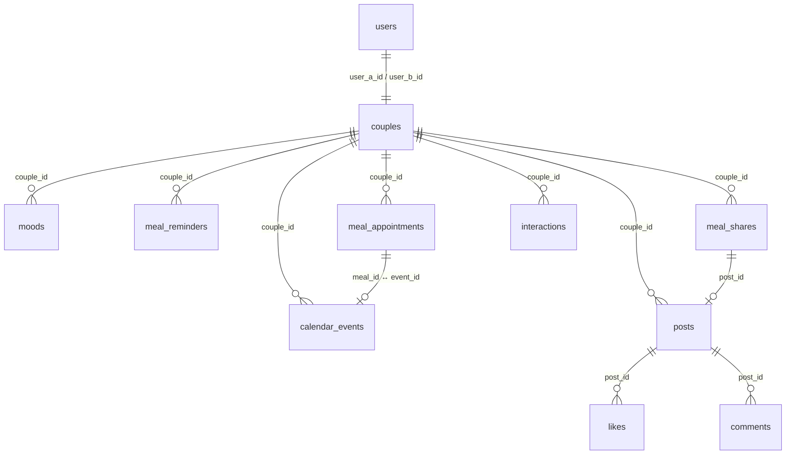

# 数据库设计 ·《两个人的小世界》

> 技术栈：微信云开发 · 云数据库（文档型，MongoDB 风格）。
> 云数据库没有传统 SQL 表——"表"对应**集合（collection）**，"行"对应**文档（document）**。文件名沿用 `sql.md` 仅为习惯，内容按云数据库规范设计。

---

## 1. 通用约定

| 项 | 约定 |
|---|---|
| 集合命名 | 复数小写 snake_case：`users`、`calendar_events` |
| 字段命名 | snake_case，与 PRD §20 数据模型一致（API 层会转为 camelCase，见 api.md §1.5） |
| `_id` | 字符串、语义化。`users` 的 `_id` 直接使用 **openid**，其他集合用业务前缀（如 `ev-xxx`） |
| 时间戳 | **毫秒时间戳 number**（`createdAt: 1789948800000`），导入方便、前端 `Date` 直接可用 |
| 纯日期 / 时刻 | `date: "2026-09-23"`（YYYY-MM-DD 字符串，用于等值过滤和月前缀过滤）；`time: "12:30"`（HH:mm） |
| 日期边界 | 所有"今天/每日限流/按天过滤"一律按**北京时间 UTC+8** 计算（云函数运行环境是 UTC，必须在代码里 +8） |
| 读写路径 | 前端一律通过云函数读写（安全规则全拒绝），权限校验在云函数内完成 |
| 软删 | 只有 `posts` 用软删（`deletedAt`），其余集合物理删除 |
| 计数冗余 | `posts.likeCount` / `posts.commentCount` 冗余存储，点赞/评论时原子更新，列表页免聚合 |
| 数据量 | 一对情侣两个人，单集合数据量极小，不做分表/分区 |

---

## 2. 集合总览

| 集合 | 用途 | 对应现有 mock（store.js） | PRD §20 实体 |
|---|---|---|---|
| `users` | 双方个人资料、电量、定位 | `me` / `ta` | User |
| `couples` | 情侣关系、恋爱起始日、共享设置、绑定码 | `couple` + `settings` | Couple（settings 为新增） |
| `moods` | 每天一条心情，随时可改 | `mood.me` / `mood.ta` | Mood |
| `meal_reminders` | 吃饭提醒记录（每日 3 次限流依据） | `remind` | MealReminder |
| `meal_appointments` | 约饭 | `meals` | MealAppointment |
| `calendar_events` | 计划事件：约会 / 纪念日 / 待办 / 约饭 | `events` | CalendarEvent |
| `posts` | 日常动态 | `posts` | Post |
| `likes` | 点赞（一人一帖一条） | `posts[].likes` | Like |
| `comments` | 评论 | `posts[].comments` | Comment |
| `meal_shares` | 餐食分享（与动态联动） | `mealShares` | MealShare |
| `interactions` | 互动事件：想你了 / 抱抱 / 我在哦 / 喝水 / 叫醒 | 无（现为本地 toast） | 新增 |
| `weather_cache` | （可选）天气缓存，30 分钟有效 | `couple.weather` | 新增 |

**天气**本身来自第三方天气 API，实时获取、不落库；`weather_cache` 仅作缓存，便于未配置第三方 API 时也能演示首页（测试数据已含上海/北京两条）。

---

## 3. 集合关系图



---

## 4. 集合详细设计

### 4.1 users — 用户

| 字段 | 类型 | 必填 | 说明 |
|---|---|---|---|
| `_id` | string | ✓ | = openid |
| `nickname` | string | ✓ | 昵称（首次登录为空串，引导去设置） |
| `avatar` | string | | 云存储 fileID，空串 = 用前端占位头像 |
| `city` | string | | 城市，如 `"上海市"`（天气、距离用） |
| `latitude` / `longitude` | number | | 可选定位（距离计算、城市推断） |
| `batteryLevel` | number | | 电量 0–100，随 `batteryUpdatedAt` 上报 |
| `batteryUpdatedAt` | number | | 电量上报时间戳（超过 24h 前端显示"未同步"） |
| `lastActiveAt` | number | | 最近活跃时间（每次调云函数自动刷新） |
| `createdAt` | number | ✓ | 注册时间 |

**索引**：`_id`（自动）。集合小，无需额外索引。

**示例文档**：

```json
{
  "_id": "demo-lin-openid",
  "nickname": "大头仔",
  "avatar": "",
  "city": "上海市",
  "batteryLevel": 45,
  "batteryUpdatedAt": 1789954800000,
  "lastActiveAt": 1789948800000,
  "createdAt": 1789516800000
}
```

### 4.2 couples — 情侣关系

| 字段 | 类型 | 必填 | 说明 |
|---|---|---|---|
| `_id` | string | ✓ | 如 `couple-demo` |
| `userAId` | string | ✓ | 发起绑定方 openid |
| `userBId` | string | | 被绑定方 openid（`waiting` 状态时为空） |
| `startDate` | string | ✓ | 恋爱起始日 YYYY-MM-DD（恋爱天数由它计算） |
| `inviteCode` | string | | 6 位数字邀请码，绑定完成后清空 |
| `inviteExpiresAt` | number | | 邀请码过期时间（30 分钟） |
| `status` | string | ✓ | `waiting`（等对方输入码）/ `active`（已绑定） |
| `settings` | object | ✓ | 双方共享设置（见下） |
| `createdAt` / `updatedAt` | number | ✓ | |

`settings` 结构（对应 profile 页五个开关，mock `store.settings`）：

```json
{
  "shareCity": true,
  "shareDistance": true,
  "mealNotify": true,
  "dateNotify": true,
  "wake": false
}
```

**索引**：`inviteCode`（唯一，绑定时查询用）、`userAId`、`userBId`。

**绑定流程设计**：一方调 `couple.genCode` → upsert 一条 `status: "waiting"` 的文档（`userAId` = 自己）；另一方调 `couple.bind` 输入码 → 找到 waiting 文档 → 填 `userBId`、置 `status: "active"`。不单独建 invite_codes 集合。

**示例文档**：

```json
{
  "_id": "couple-demo",
  "userAId": "demo-lin-openid",
  "userBId": "demo-su-openid",
  "startDate": "2016-11-19",
  "inviteCode": "",
  "status": "active",
  "settings": {
    "shareCity": true,
    "shareDistance": true,
    "mealNotify": true,
    "dateNotify": true,
    "wake": false
  },
  "createdAt": 1789516800000,
  "updatedAt": 1789948800000
}
```

### 4.3 moods — 心情（一人一天一条）

| 字段 | 类型 | 必填 | 说明 |
|---|---|---|---|
| `_id` | string | ✓ | 如 `mood-lin-2026-09-21` |
| `coupleId` | string | ✓ | 所属情侣 |
| `userId` | string | ✓ | 谁的心情（openid） |
| `date` | string | ✓ | YYYY-MM-DD（北京时间） |
| `moodType` | string | ✓ | 枚举：喜悦 / 悲伤 / 愤怒 / 害怕 / 喜欢 / 平静 / 乐观 / 兴奋 / 焦虑 |
| `createdAt` / `updatedAt` | number | ✓ | |

**规则**：一天一个心情，随时可改 → 云函数内按 `(coupleId, userId, date)` **upsert**，不产生多条。

**索引**：`coupleId + date + userId`（组合唯一索引，防重复 + 查询"今日双方心情"）。

### 4.4 meal_reminders — 吃饭提醒

| 字段 | 类型 | 必填 | 说明 |
|---|---|---|---|
| `_id` | string | ✓ | |
| `coupleId` | string | ✓ | |
| `senderId` | string | ✓ | 提醒人 openid |
| `receiverId` | string | ✓ | 被提醒人 openid |
| `date` | string | ✓ | YYYY-MM-DD（**限流统计维度**：同 sender 同 date 最多 3 条） |
| `content` | string | ✓ | 发送的文案（云函数从文案池随机） |
| `createdAt` | number | ✓ | |

**规则**：每日 3 次上限在**服务端**校验（count where senderId=me, date=today ≥ 3 → 拒绝）。跨天自动"清零"——因为限流按 `date` 字段统计，无需定时任务。

**索引**：`senderId + date`。

### 4.5 meal_appointments — 约饭

| 字段 | 类型 | 必填 | 说明 |
|---|---|---|---|
| `_id` | string | ✓ | 如 `meal-xxx` |
| `coupleId` | string | ✓ | |
| `creatorId` | string | ✓ | 创建人 openid |
| `title` | string | ✓ | 吃什么，如 `"火锅"` |
| `date` | string | ✓ | YYYY-MM-DD |
| `time` | string | ✓ | HH:mm |
| `city` | string | ✓ | |
| `location` | string | ✓ | 地点名 |
| `coverImage` | string | | 云存储 fileID（add-meal 页的照片插槽） |
| `note` | string | | 备注 |
| `status` | string | ✓ | `upcoming` / `done` / `cancelled` |
| `eventId` | string | ✓ | **联动**：对应 `calendar_events._id` |
| `createdAt` / `updatedAt` | number | ✓ | |

**索引**：`coupleId + date`、`coupleId + status + date`。

### 4.6 calendar_events — 计划事件（月历数据源）

| 字段 | 类型 | 必填 | 说明 |
|---|---|---|---|
| `_id` | string | ✓ | 如 `ev-xxx` |
| `coupleId` | string | ✓ | |
| `creatorId` | string | ✓ | 创建人（仅创建者可编辑/删除） |
| `title` | string | ✓ | 如 `"看电影"` |
| `eventType` | string | ✓ | `date`（约会）/ `anniversary`（纪念日）/ `todo`（待办）/ `meal`（约饭联动） |
| `date` | string | ✓ | YYYY-MM-DD |
| `time` | string | | HH:mm（纪念日/待办可空） |
| `city` | string | | 待办可为空 |
| `location` | string | | 待办可为空 |
| `image` | string | | 云存储 fileID |
| `note` | string | | |
| `status` | string | ✓ | `active` / `cancelled` |
| `mealId` | string | | `eventType="meal"` 时关联 `meal_appointments._id` |
| `createdAt` / `updatedAt` | number | ✓ | |

**索引**：`coupleId + date`（月历按月前缀查询）、`coupleId + eventType + date`（upcoming 过滤 todo）。

### 4.7 posts — 日常动态

| 字段 | 类型 | 必填 | 说明 |
|---|---|---|---|
| `_id` | string | ✓ | 如 `post-xxx` |
| `coupleId` | string | ✓ | |
| `userId` | string | ✓ | 发布人 openid |
| `type` | string | ✓ | `normal` / `meal`（餐食分享联动）/ `date`（约会记录，预留） |
| `content` | string | | 文字（与 images 至少其一） |
| `images` | string[] | | 云存储 fileID 数组（最多 9 张） |
| `location` | string | | 位置文案（发布时默认取我的 city） |
| `tags` | string[] | | 标签，如 `["约会日", "想你"]` |
| `likeCount` | number | ✓ | 冗余计数，初始 0 |
| `commentCount` | number | ✓ | 冗余计数，初始 0 |
| `deletedAt` | number \| null | ✓ | 软删标记，null = 未删 |
| `createdAt` | number | ✓ | |

**索引**：`coupleId + deletedAt + createdAt`（动态流倒序查询）。

### 4.8 likes — 点赞

| 字段 | 类型 | 必填 | 说明 |
|---|---|---|---|
| `_id` | string | ✓ | |
| `postId` | string | ✓ | |
| `userId` | string | ✓ | |
| `createdAt` | number | ✓ | |

**规则**：`(postId, userId)` 组合唯一（一人一帖一条，云函数内先查后插/删实现 toggle，删除帖子不级联删除——帖子已软删不可见）。

**索引**：`postId + userId`（组合唯一）、`postId`。

### 4.9 comments — 评论

| 字段 | 类型 | 必填 | 说明 |
|---|---|---|---|
| `_id` | string | ✓ | |
| `postId` | string | ✓ | |
| `userId` | string | ✓ | |
| `content` | string | ✓ | |
| `createdAt` | number | ✓ | |

**索引**：`postId + createdAt`。

### 4.10 meal_shares — 餐食分享

| 字段 | 类型 | 必填 | 说明 |
|---|---|---|---|
| `_id` | string | ✓ | 如 `ms-xxx` |
| `coupleId` | string | ✓ | |
| `userId` | string | ✓ | |
| `content` | string | ✓ | 一句话 |
| `images` | string[] | ✓ | 云存储 fileID（1–9 张） |
| `postId` | string | | **联动**：同步写入日常的 `posts._id` |
| `createdAt` | number | ✓ | |

**索引**：`coupleId + createdAt`。

### 4.11 interactions — 互动事件

| 字段 | 类型 | 必填 | 说明 |
|---|---|---|---|
| `_id` | string | ✓ | |
| `coupleId` | string | ✓ | |
| `senderId` | string | ✓ | 发起方 |
| `receiverId` | string | ✓ | 接收方 |
| `type` | string | ✓ | `miss_you` / `hug` / `im_here` / `water` / `wake` |
| `content` | string | | 文案（默认文案或自定义） |
| `createdAt` | number | ✓ | |

**用途**：① 落库留痕（P1 可做"收到的互动"提醒页）；② 触发微信订阅消息推送（见 api.md §1.8）。

**索引**：`coupleId + createdAt`、`receiverId + createdAt`。

### 4.12 weather_cache — 天气缓存（可选）

| 字段 | 类型 | 必填 | 说明 |
|---|---|---|---|
| `_id` | string | ✓ | = 城市名，如 `"上海市"` |
| `city` | string | ✓ | |
| `temp` | number | ✓ | 当前温度 ℃ |
| `cond` | string | ✓ | 天气描述，如 `"多云"` |
| `high` / `low` | number | ✓ | 最高/最低温 |
| `updatedAt` | number | ✓ | 缓存时间（超过 30 分钟云函数重新拉取第三方） |

---

## 5. 集合 ↔ 现有 mock 数据对照

改造前端时，按此表把 `utils/store.js` 的本地结构替换为接口数据：

| store.js 结构 | 落库集合 | 差异说明 |
|---|---|---|
| `me` / `ta` | `users` | 增加 openid / 电量更新时间 / lastActiveAt；头像从"SVG 由 id 生成"变为云存储 fileID |
| `couple.start` / `couple.distanceKm` | `couples` | distanceKm **不落库**，由双方城市/定位实时计算 |
| `couple.weather` | 第三方 API + `weather_cache` | |
| `mood.me` / `mood.ta` | `moods` | 增加 `date`，按天 upsert |
| `remind`（date+count） | `meal_reminders` | 不再存 count 字段，count 由 `date` 当天记录数实时统计 |
| `meals` | `meal_appointments` | 增加 status / eventId / coverImage |
| `events` | `calendar_events` | 字段基本一一对应（type → eventType） |
| `posts` | `posts` + `likes` + `comments` | mock 中 likes/comments **内嵌**在 post 里，落库**拆开**为独立集合，用冗余计数保持列表性能 |
| `posts[].photoCount` | `posts.images[]` | 占位格 → 真实 fileID 数组 |
| `mealShares` | `meal_shares` | 增加 images[] / postId |
| `settings` | `couples.settings` | 从顶层移到情侣文档内（双方共享一份） |
| 想你了/抱抱/提醒 toast | `interactions` | 原来不落库，现在留痕 + 推送 |

---

## 6. 测试数据

### 6.1 说明

- 格式：**JSON Lines**（每行一个完整 JSON 对象），与云开发控制台"数据库 → 导入"格式一致。
- 以下数据以 **2026-09-21 为"今天"** 设计：约饭 +2 天、约会 +8/+16 天等，与现有 seed 的相对日期一致。
- 若导入当天已过 2026-09-21：把 `date` 字段改成未来的日期即可；`createdAt` 等时间戳可保留（相对时间文案会自动变远，不影响功能）。
- 时间戳对照（北京时间）：`1789948800000` = 09-21 08:00 · `1789945200000` = 09-21 07:00 · `1789941600000` = 09-21 06:00 · `1789862400000` = 09-20 08:00 · `1789689600000` = 09-18 08:00 · `1789603200000` = 09-17 08:00 · `1789516800000` = 09-16 08:00。
- **更省事的初始化方式**：业务云函数 `love288-api` 内置 `init.seed` 动作，云端调用一次即可自动创建 12 个集合并写入演示数据（幂等，重跑还原初始状态）。其种子数据与本节一致，但日期/时间戳**相对运行当天生成**（约饭 +2 天、约会 +8/+16 天…），永远新鲜；只有手动导入本节的固定日期数据时才需要调整 `date`。

### 6.2 users（文件名建议：`users.json`）

```json
{"_id":"demo-lin-openid","nickname":"大头仔","avatar":"","city":"上海市","batteryLevel":45,"batteryUpdatedAt":1789954800000,"lastActiveAt":1789948800000,"createdAt":1789516800000}
{"_id":"demo-su-openid","nickname":"宝宝","avatar":"","city":"北京市","batteryLevel":65,"batteryUpdatedAt":1789953120000,"lastActiveAt":1789948800000,"createdAt":1789516800000}
```

### 6.3 couples（`couples.json`）

```json
{"_id":"couple-demo","userAId":"demo-lin-openid","userBId":"demo-su-openid","startDate":"2016-11-19","inviteCode":"","status":"active","settings":{"shareCity":true,"shareDistance":true,"mealNotify":true,"dateNotify":true,"wake":false},"createdAt":1789516800000,"updatedAt":1789948800000}
```

### 6.4 moods（`moods.json`）— 今天双方各一条

```json
{"_id":"mood-lin-2026-09-21","coupleId":"couple-demo","userId":"demo-lin-openid","date":"2026-09-21","moodType":"平静","createdAt":1789945200000,"updatedAt":1789945200000}
{"_id":"mood-su-2026-09-21","coupleId":"couple-demo","userId":"demo-su-openid","date":"2026-09-21","moodType":"喜悦","createdAt":1789941600000,"updatedAt":1789941600000}
```

### 6.5 meal_reminders（`meal_reminders.json`）— 今天已提醒 1 次

```json
{"_id":"mr-1","coupleId":"couple-demo","senderId":"demo-lin-openid","receiverId":"demo-su-openid","date":"2026-09-21","content":"记得好好吃饭呀～","createdAt":1789941600000}
```

### 6.6 meal_appointments（`meal_appointments.json`）— 最近约饭 1 条

```json
{"_id":"meal-1","coupleId":"couple-demo","creatorId":"demo-lin-openid","title":"火锅","date":"2026-09-23","time":"12:30","city":"上海市","location":"海底捞（陆家嘴店）","coverImage":"","note":"和你一起吃饭，真好～ ❤️","status":"upcoming","eventId":"ev-meal-1","createdAt":1789862400000,"updatedAt":1789862400000}
```

### 6.7 calendar_events（`calendar_events.json`）— 4 条事件 + 1 条约饭联动

```json
{"_id":"ev-1","coupleId":"couple-demo","creatorId":"demo-lin-openid","title":"看电影","eventType":"date","date":"2026-09-29","time":"19:00","city":"上海市","location":"CGV影城","image":"","note":"记得提前买票哦～","status":"active","createdAt":1789862400000,"updatedAt":1789862400000}
{"_id":"ev-2","coupleId":"couple-demo","creatorId":"demo-su-openid","title":"去看海","eventType":"date","date":"2026-10-07","time":"09:00","city":"青岛市","location":"五四广场","image":"","note":"终于可以一起去看海啦～","status":"active","createdAt":1789689600000,"updatedAt":1789689600000}
{"_id":"ev-3","coupleId":"couple-demo","creatorId":"demo-lin-openid","title":"一周年纪念日","eventType":"anniversary","date":"2026-11-10","time":"","city":"","location":"","image":"","note":"和你在一起一周年 ❤️","status":"active","createdAt":1789516800000,"updatedAt":1789516800000}
{"_id":"ev-4","coupleId":"couple-demo","creatorId":"demo-lin-openid","title":"帮 TA 挑生日礼物","eventType":"todo","date":"2026-09-25","time":"20:00","city":"","location":"","image":"","note":"想挑一件 TA 会喜欢的","status":"active","createdAt":1789862400000,"updatedAt":1789862400000}
{"_id":"ev-meal-1","coupleId":"couple-demo","creatorId":"demo-lin-openid","title":"火锅","eventType":"meal","date":"2026-09-23","time":"12:30","city":"上海市","location":"海底捞（陆家嘴店）","image":"","note":"和你一起吃饭，真好～ ❤️","status":"active","mealId":"meal-1","createdAt":1789862400000,"updatedAt":1789862400000}
```

### 6.8 posts（`posts.json`）— 3 条动态

```json
{"_id":"post-1","coupleId":"couple-demo","userId":"demo-lin-openid","type":"normal","content":"今天和苏棠一起去看了新开的展览～\n好喜欢这幅画！❤️","images":[],"location":"上海市","tags":["约会日"],"likeCount":2,"commentCount":1,"deletedAt":null,"createdAt":1789941600000}
{"_id":"post-2","coupleId":"couple-demo","userId":"demo-su-openid","type":"meal","content":"今天的便当打卡～\n好好吃饭，等我回去一起吃火锅！","images":[],"location":"北京市","tags":[],"likeCount":1,"commentCount":0,"deletedAt":null,"createdAt":1789862400000}
{"_id":"post-3","coupleId":"couple-demo","userId":"demo-lin-openid","type":"normal","content":"想到很快就能见到你，工作都有动力了 ☀️","images":[],"location":"上海市","tags":["想你"],"likeCount":0,"commentCount":0,"deletedAt":null,"createdAt":1789689600000}
```

> 注：原 mock 中 `photoCount` 已升级为 `images[]`（fileID 数组）。测试数据无真实图片，`images` 给空数组，图片区块靠前端占位样式展示。

### 6.9 likes（`likes.json`）— 与 posts 的 likeCount 一致

```json
{"_id":"like-1","postId":"post-1","userId":"demo-lin-openid","createdAt":1789941600000}
{"_id":"like-2","postId":"post-1","userId":"demo-su-openid","createdAt":1789945200000}
{"_id":"like-3","postId":"post-2","userId":"demo-lin-openid","createdAt":1789862400000}
```

### 6.10 comments（`comments.json`）

```json
{"_id":"cmt-1","postId":"post-1","userId":"demo-su-openid","content":"下次还要一起去呀～","createdAt":1789945200000}
```

### 6.11 meal_shares（`meal_shares.json`）— 2 条历史分享

```json
{"_id":"ms-1","coupleId":"couple-demo","userId":"demo-su-openid","content":"今天也要好好吃饭呀～ ❤️","images":[],"postId":null,"createdAt":1789862400000}
{"_id":"ms-2","coupleId":"couple-demo","userId":"demo-lin-openid","content":"加班也要认真吃晚饭！","images":[],"postId":null,"createdAt":1789603200000}
```

### 6.12 interactions（`interactions.json`）— 2 条示例

```json
{"_id":"it-1","coupleId":"couple-demo","senderId":"demo-lin-openid","receiverId":"demo-su-openid","type":"miss_you","content":"想你了","createdAt":1789941600000}
{"_id":"it-2","coupleId":"couple-demo","senderId":"demo-lin-openid","receiverId":"demo-su-openid","type":"water","content":"提醒 TA 喝水","createdAt":1789945200000}
```

### 6.13 weather_cache（`weather_cache.json`）— 可选，保证首页天气卡有数据

```json
{"_id":"上海市","city":"上海市","temp":26,"cond":"多云","high":28,"low":22,"updatedAt":1789948800000}
{"_id":"北京市","city":"北京市","temp":21,"cond":"晴","high":24,"low":16,"updatedAt":1789948800000}
```

### 6.14 初始化步骤

**方式一（推荐）：云函数 init.seed 一键初始化**
1. 微信开发者工具中右键 `cloudfunctions/love288-api` →「上传并部署：云端安装依赖」。
2. 云开发控制台 → 云函数 → love288-api → 云端测试，参数 `{"type":"init.seed"}`。
3. 返回 `{ code: 0, data: { collections: 12, seeded: 25 } }` 即成功；数据库页可核对 12 个集合。
4. 玩乱后重跑即可还原演示初始状态（仅演示模式可执行，见 api.md）。

**方式二：控制台手动导入**
1. 微信开发者工具 → 云开发控制台 → **数据库**。
2. 按 6.2–6.13 依次**创建集合**（`users`、`couples`、`moods`、`meal_reminders`、`meal_appointments`、`calendar_events`、`posts`、`likes`、`comments`、`meal_shares`、`interactions`、`weather_cache`）。
3. 进入每个集合 → **导入** → 选择对应 JSON Lines 文件 → 冲突模式选 **Insert（插入）**。
4. 在控制台按 4.x 节的索引建议建索引。

### 6.15 导入后验收点

| 页面 | 应看到 |
|---|---|
| 首页 | 双方状态卡、恋爱天数、天气、电量、双方心情、下次见面"2天后 · 火锅" |
| 好好吃饭 | 最近约饭"火锅 海底捞"、今日已提醒 1/3 次、2 条历史餐食 |
| 日常 | 3 条动态，post-1 有 2 赞 1 评论 |
| 计划 | 9 月月历上 9/23、9/25、9/29 有标记；"即将到来的约会"3 条 |
| 约会详情 | 点"看电影"进入详情，可编辑/删除（创建者是 lin） |
